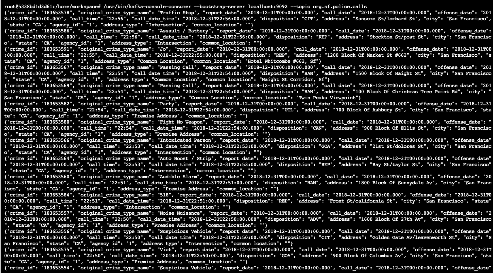
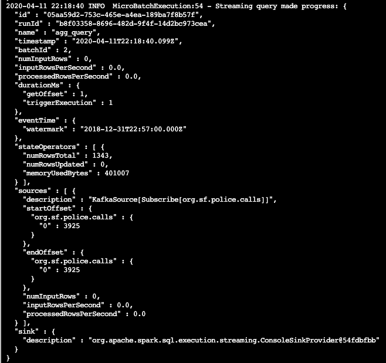
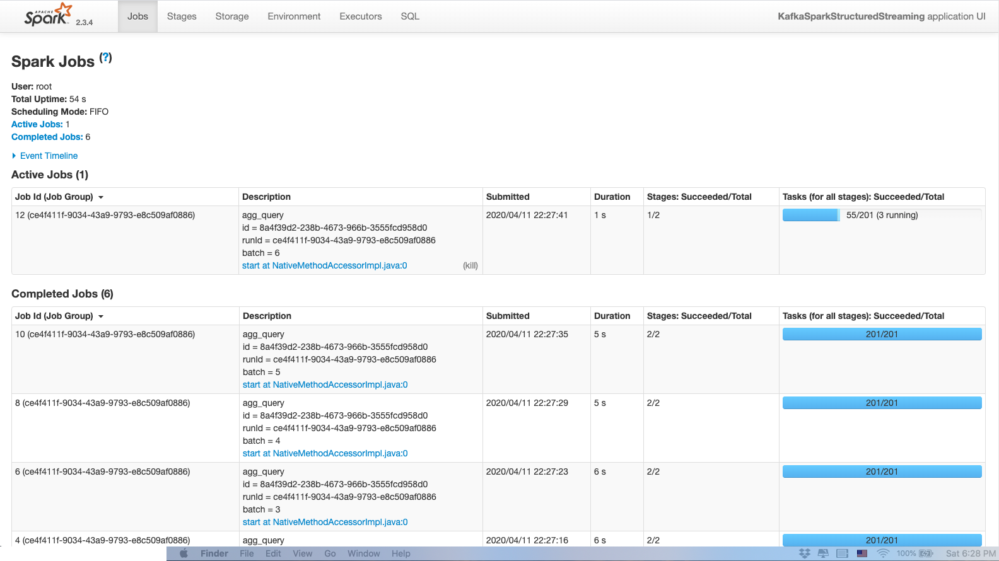

# SF Crime Statistics with Spark Streaming

## Project Overview

In this project, I will be provided with a real-world dataset, extracted from Kaggle, on San Francisco crime incidents, and I will provide statistical analyses of the data using Apache Spark Structured Streaming. I will draw on the skills and knowledge I've learned in Udacity Data Streaming Nanodegree to create a Kafka server to produce data, and ingest data through Spark Structured Streaming.

### Development Environment

- Spark 2.4.3
- Scala 2.11.x
- Java 1.8.x
- Kafka build with Scala 2.11.x
- Python 3.6.x or 3.7.x

## Steps
### Start Zookeeper and Kafka server
This project requires creating topics, starting Zookeeper and Kafka servers, and your Kafka bootstrap server. You’ll need to choose a port number (e.g., 9092, 9093..) for your Kafka topic, and come up with a Kafka topic name and modify the zookeeper.properties and server.properties appropriately.

- Install requirements using ./start.sh if you use conda for Python. If you use pip rather than conda, then use pip install -r requirements.txt.

- Use the commands below to start the Zookeeper and Kafka servers. You can find the bin and config folder in the Kafka binary that you have downloaded and unzipped.

```shell
/usr/bin/zookeeper-server-start config/zookeeper.properties
/usr/bin/kafka-server-start config/server.properties
```

### Step 1
- The first step is to build a simple Kafka server.
- Code for the server are in `producer_server.py` and `kafka_server.py`.

Run following code to start the producer:
```python
python kafka_server.py
```
To check if  `kafka_server.py` is working properly, run following command :
```shell
python consumer_server.py
```
To see the output, use following command
```shell
kafka-console-consumer --bootstrap-server localhost:9092 --topic org.sf.police.calls --from-beginning
```
Sreenshot of the output:



### Step 2
- Apache Spark already has an integration with Kafka brokers, so we would not normally need a separate Kafka consumer. However, we are going to ask you to create one anyway. Why? We'd like you to create the consumer to demonstrate your understanding of creating a complete Kafka Module (producer and consumer) from scratch. In production, you might have to create a dummy producer or consumer to just test out your theory and this will be great practice for that.
- Code for stream processing are in `data_stream.py`.

- Do a spark-submit using this command: 
```shell
spark-submit --packages org.apache.spark:spark-sql-kafka-0-10_2.11:2.3.4 --master local[*] data_stream.py
```
Sreenshot of progress reporter:



Sreenshot of Spark Streaming UI:




### Step 3
1. How did changing values on the SparkSession property parameters affect the throughput and latency of the data?

   In the code I have played around with the parameters `maxRatePerPartition` and `maxOffsetsPerTrigger` for a bit. 

   `maxRatePerPartition` is used to set the maximum number of messages per partition per batch. 
   `maxOffsetsPerTrigger` is used to limit the number of records to fetch per trigger.
   Increasing each or both of them will increase the throughput as well as the latency of the data.
   
2. What were the 2-3 most efficient SparkSession property key/value pairs? Through testing multiple variations on values, how can you tell these were the most optimal?
{`maxRatePerPartition`:  500, `maxOffsetsPerTrigger`: 500} is the most efficient pairs. Since there is processing time in the aggregation and joining calculation, we do not want to limit too few data points in one batch since that will cause inefficiency in calcualtion each time. But we also do not want to include too many data points in one batch since the latency of the output will be pretty high. So after testing I find out 500 is a balanced number to use.